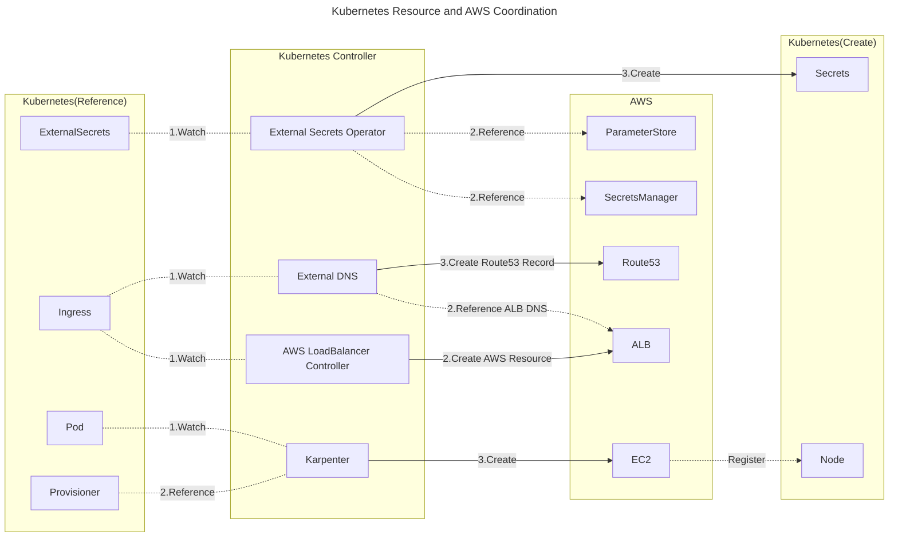
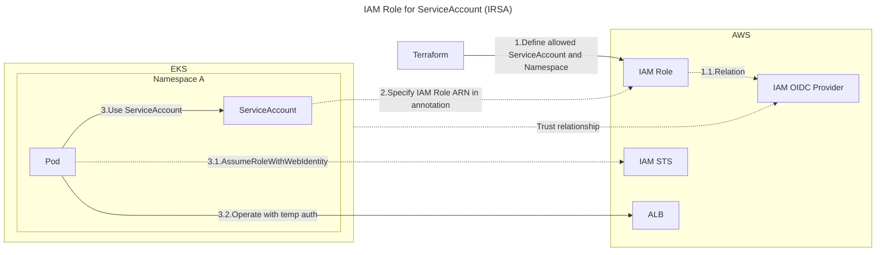

# kubernetes-lab

## Kubernetes Controller and AWS Relation

Some Kubernetes controllers and containers are closely associated with AWS resources. The figure below is an example of the relationship between Kubernetes resources and AWS resources. Various controllers operating in Kubernetes monitor the status of targeted Kubernetes resources and create or refer to AWS resources in accordance with YAML definitions. For instance, the AWS LoadBalancer Controller monitors the Kubernetes Ingress resources, and when an Ingress resource is created, it corresponds to creating an AWS ALB. Furthermore, External DNS monitors Kubernetes Ingress resources and when an Ingress resource is created, it creates a Route53 record that aligns the hostname and the ALB DNS.

## Operate AWS in Kubernetes.

To manage AWS resources from containers running in Kubernetes, you must be authenticated by IAM at the time of AWS operation. However, since IAM is a feature of AWS, it's difficult to call IAM directly from the container, and it's necessary to somehow pass the IAM authentication information to the container. EKS has a mechanism for passing IAM authentication, which is called [IAM Role for ServiceAccount(IRSA)](https://docs.aws.amazon.com/eks/latest/userguide/iam-roles-for-service-accounts.html) and [EKS Pod Identities](https://docs.aws.amazon.com/ja_jp/eks/latest/userguide/pod-identities.html).

**IAM Role for ServiceAccount(IRSA)**

To use IRSA, you must setup OIDC and EKS trust relationship beforehand.

* Create OIDC Provider which trust EKS Cluster.

IRSA is comprised of three steps.

1. Create an IAM Role. At this time, specify the EKS cluster, Service Account, and Namespace that will utilize IAM Role authentication.
2. Set the IAM Role ARN for the ServiceAccount specified in the above step.
3. When using the Service Account specified above in a Pod, the AWS authentication information is inserted into the environment variables by IRSA at the time of Manifest apply. Now Container authenticated by sts and it can operate AWS with temporary auth.

The following diagram illustrates the association between Kubernetes resources and AWS when using IRSA.

**EKS Pod Identities**

[TBD]
