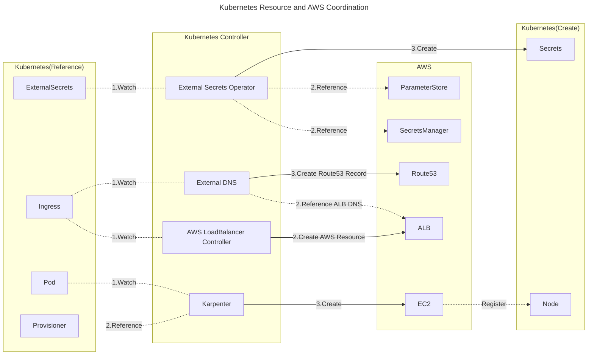

# kubernetes-lab

## Kubernetes Controller and AWS Relation

Some Kubernetes controllers and containers are closely associated with AWS resources. The figure below is an example of the relationship between Kubernetes resources and AWS resources. Various controllers operating in Kubernetes monitor the status of targeted Kubernetes resources and create or refer to AWS resources in accordance with YAML definitions. For instance, the AWS LoadBalancer Controller monitors the Kubernetes Ingress resources, and when an Ingress resource is created, it corresponds to creating an AWS ALB. Furthermore, External DNS monitors Kubernetes Ingress resources and when an Ingress resource is created, it creates a Route53 record that aligns the hostname and the ALB DNS.

