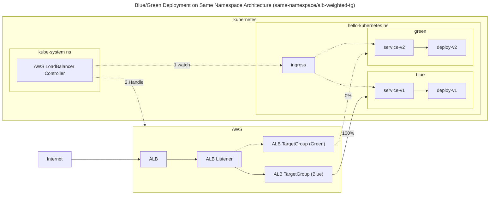
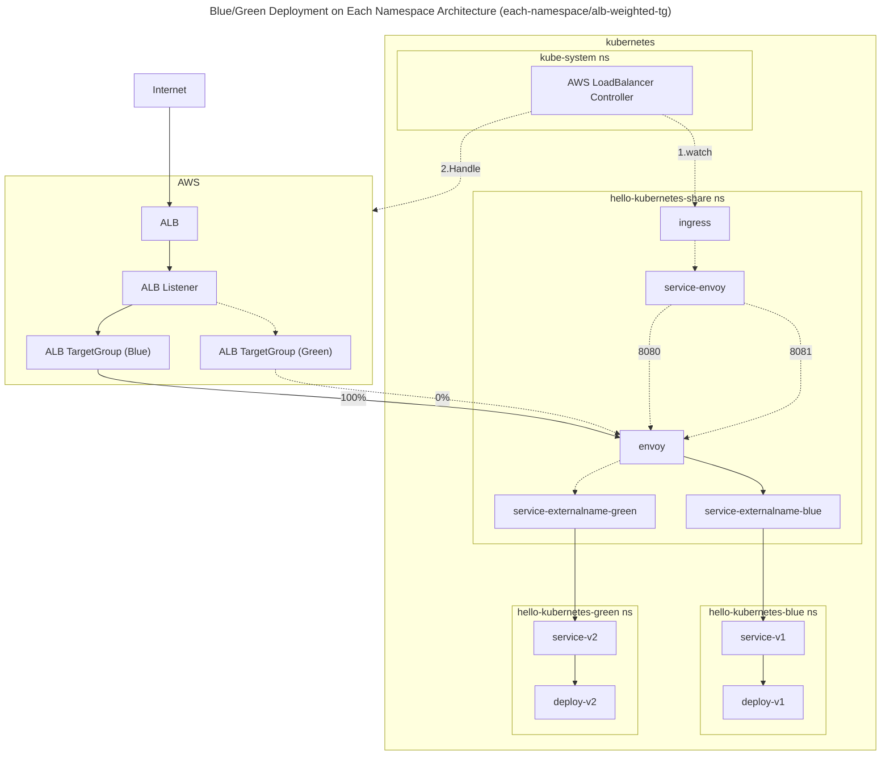
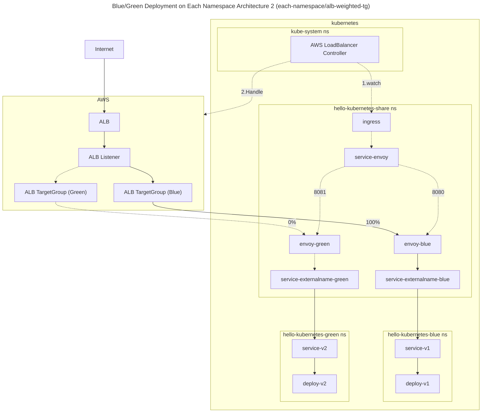

# README

# Blue/Green Deployment on Same Namespace

## same-namespace/alb-weighted-tg

Blue/Green Deployment on same namespace with ALB Weighted TargetGroup.



### Getting Started

Deploy Apps.

```shell
helm upgrade --install v1 ./helm/hello-kubernetes \
  --namespace hello-kubernetes \
  --set message="You are reaching hello-kubernetes version 1" \
  --set ingress.configured=true \
  --set service.type="ClusterIP" \
  --create-namespace \
  --wait
```

```shell
helm upgrade --install v2 ./helm/hello-kubernetes \
  --namespace hello-kubernetes \
  --set message="You are reaching hello-kubernetes version 2" \
  --set ingress.configured=true \
  --set service.type="ClusterIP" \
  --create-namespace \
  --wait
```

**Blue deployment**

Deploy ingress and create ALB.

```shell
kubectl kustomize ./blue-green/same-namespace/alb-weighted-tg/ingress/overlays/v1 | kubectl apply -f -
```

Access to ALB, make sure all trafics are routed to v1.

```shell
endpoint=$(kubectl get ingress hello-kubernetes -n hello-kubernetes -o jsonpath='{.status.loadBalancer.ingress[0].hostname}')
echo "$endpoint"
while true; do curl -s "$endpoint" | grep version; sleep 1; done
```

```
  You are reaching hello-kubernetes version 1
  You are reaching hello-kubernetes version 1
  You are reaching hello-kubernetes version 1
  You are reaching hello-kubernetes version 1
  You are reaching hello-kubernetes version 1
```


**Green deployment**

Change Ingress route to v2.

```shell
kubectl kustomize ./blue-green/same-namespace/alb-weighted-tg/ingress/overlays/v2 | kubectl apply -f -
```

Access to ALB, make sure all trafics are routed to v2.

```shell
endpoint=$(kubectl get ingress hello-kubernetes -n hello-kubernetes -o jsonpath='{.status.loadBalancer.ingress[0].hostname}')
echo "$endpoint"
while true; do curl -s "$endpoint" | grep version; sleep 1; done
```

```
  You are reaching hello-kubernetes version 2
  You are reaching hello-kubernetes version 2
  You are reaching hello-kubernetes version 2
  You are reaching hello-kubernetes version 2
  You are reaching hello-kubernetes version 2
```


### Canaly deployment

Change Ingress route to use canaly, let's route 90％ traffic to v1 and 10％ to green.

```shell
kubectl kustomize ./blue-green/same-namespace/alb-weighted-tg/ingress/overlays/canaly | kubectl apply -f -
```

Access to ALB, make sure trafiic is routed to v1 and v2 for 90:10.

```shell
endpoint=$(kubectl get ingress hello-kubernetes -n hello-kubernetes -o jsonpath='{.status.loadBalancer.ingress[0].hostname}')
echo "$endpoint"
while true; do curl -s "$endpoint" | grep version; sleep 1; done
```

```
  You are reaching hello-kubernetes version 1
  You are reaching hello-kubernetes version 1
  You are reaching hello-kubernetes version 1
  You are reaching hello-kubernetes version 1
  You are reaching hello-kubernetes version 1
  You are reaching hello-kubernetes version 1
  You are reaching hello-kubernetes version 1
  You are reaching hello-kubernetes version 1
  You are reaching hello-kubernetes version 1
  You are reaching hello-kubernetes version 2
  You are reaching hello-kubernetes version 1
  You are reaching hello-kubernetes version 1
  You are reaching hello-kubernetes version 1
  You are reaching hello-kubernetes version 1
  You are reaching hello-kubernetes version 1
  You are reaching hello-kubernetes version 1
  You are reaching hello-kubernetes version 1
  You are reaching hello-kubernetes version 1
  You are reaching hello-kubernetes version 1
  You are reaching hello-kubernetes version 2
```

### Clean up

Delete all resources.

```shell
kubectl kustomize ./blue-green/same-namespace/alb-weighted-tg/ingress/overlays/v1 | kubectl delete -f -
helm uninstall v1 --namespace hello-kubernetes
helm uninstall v2 --namespace hello-kubernetes
kubectl delete ns hello-kubernetes
```


# Blue/Green Deployment on Each Namespace

## each-namespace/alb-weighted-tg

Blue/Green Deployment on different namespace with ALB Weighted TargetGroup.



> [!TIPS]
> OTHER IDEA. We can split envoy to blue/green. However this has to handle HPA and another envoy. If you don't use HPA, then this can control envoy pod replicas.




### Getting Started

Deploy Apps.

```shell
helm upgrade --install v1 ./helm/hello-kubernetes \
  --namespace hello-kubernetes-blue \
  --set message="You are reaching hello-kubernetes version 1" \
  --set ingress.configured=true \
  --set service.type="ClusterIP" \
  --create-namespace \
  --wait
```

```shell
helm upgrade --install v2 ./helm/hello-kubernetes \
  --namespace hello-kubernetes-green \
  --set message="You are reaching hello-kubernetes version 2" \
  --set ingress.configured=true \
  --set service.type="ClusterIP" \
  --create-namespace \
  --wait
```


**Blue deployment**

Deploy ingress and create ALB.

```shell
kubectl kustomize ./blue-green/each-namespace/alb-weighted-tg/ingress/overlays/v1 | kubectl apply -f -
```

Access to ALB, make sure all trafics are routed to v1.

```shell
endpoint=$(kubectl get ingress hello-kubernetes -n hello-kubernetes-share -o jsonpath='{.status.loadBalancer.ingress[0].hostname}')
echo "$endpoint"
while true; do curl -s "$endpoint" | grep version; sleep 1; done
```

```
  You are reaching hello-kubernetes version 1
  You are reaching hello-kubernetes version 1
  You are reaching hello-kubernetes version 1
  You are reaching hello-kubernetes version 1
  You are reaching hello-kubernetes version 1
```

**Green deployment**

Change Ingress route to v2.

```shell
kubectl kustomize ./blue-green/each-namespace/alb-weighted-tg/ingress/overlays/v2 | kubectl apply -f -
```

Access to ALB, make sure all trafics are routed to v2.

```shell
endpoint=$(kubectl get ingress hello-kubernetes -n hello-kubernetes-share -o jsonpath='{.status.loadBalancer.ingress[0].hostname}')
echo "$endpoint"
while true; do curl -s "$endpoint" | grep version; sleep 1; done
```

```
  You are reaching hello-kubernetes version 2
  You are reaching hello-kubernetes version 2
  You are reaching hello-kubernetes version 2
  You are reaching hello-kubernetes version 2
  You are reaching hello-kubernetes version 2
```

### Canaly deployment

Change Ingress route to use canaly, let's route 90％ traffic to v1 and 10％ to green.

```shell
kubectl kustomize ./blue-green/each-namespace/alb-weighted-tg/ingress/overlays/canaly | kubectl apply -f -
```

Access to ALB, make sure trafiic is routed to v1 and v2 for 90:10.

```shell
endpoint=$(kubectl get ingress hello-kubernetes -n hello-kubernetes-share -o jsonpath='{.status.loadBalancer.ingress[0].hostname}')
echo "$endpoint"
while true; do curl -s "$endpoint" | grep version; sleep 1; done
```

```
  You are reaching hello-kubernetes version 1
  You are reaching hello-kubernetes version 1
  You are reaching hello-kubernetes version 1
  You are reaching hello-kubernetes version 1
  You are reaching hello-kubernetes version 1
  You are reaching hello-kubernetes version 1
  You are reaching hello-kubernetes version 1
  You are reaching hello-kubernetes version 2
  You are reaching hello-kubernetes version 1
  You are reaching hello-kubernetes version 1
  You are reaching hello-kubernetes version 1
  You are reaching hello-kubernetes version 1
  You are reaching hello-kubernetes version 1
  You are reaching hello-kubernetes version 1
  You are reaching hello-kubernetes version 2
  You are reaching hello-kubernetes version 1
  You are reaching hello-kubernetes version 1
  You are reaching hello-kubernetes version 2
  You are reaching hello-kubernetes version 2
  You are reaching hello-kubernetes version 1
  You are reaching hello-kubernetes version 1
  You are reaching hello-kubernetes version 1
  You are reaching hello-kubernetes version 1
  You are reaching hello-kubernetes version 1
  You are reaching hello-kubernetes version 1
  You are reaching hello-kubernetes version 1
  You are reaching hello-kubernetes version 1
  You are reaching hello-kubernetes version 1
  You are reaching hello-kubernetes version 1
  You are reaching hello-kubernetes version 2
```

### Clean up

Delete all resources.

```shell
kubectl kustomize ./blue-green/each-namespace/alb-weighted-tg/ingress/overlays/v1 | kubectl delete -f -
helm uninstall v1 --namespace hello-kubernetes-blue
helm uninstall v2 --namespace hello-kubernetes-green
kubectl delete ns hello-kubernetes-share
```


### Getting Started

Deploy Apps.

```shell
helm upgrade --install v1 ./helm/hello-kubernetes \
  --namespace hello-kubernetes-blue \
  --set message="You are reaching hello-kubernetes version 1" \
  --set ingress.configured=true \
  --set service.type="ClusterIP" \
  --create-namespace \
  --wait
```

```shell
helm upgrade --install v2 ./helm/hello-kubernetes \
  --namespace hello-kubernetes-green \
  --set message="You are reaching hello-kubernetes version 2" \
  --set ingress.configured=true \
  --set service.type="ClusterIP" \
  --create-namespace \
  --wait
```


**Blue deployment**

Deploy ingress and create ALB.

```shell
k kustomize ./blue-green/each-namespace/alb-weighted-tg2/ingress/overlays/v1 | kubectl apply -f -
```

Access to ALB, make sure all trafics are routed to v1.

```shell
endpoint=$(kubectl get ingress hello-kubernetes -n hello-kubernetes-share -o jsonpath='{.status.loadBalancer.ingress[0].hostname}')
echo "$endpoint"
while true; do curl -s "$endpoint" | grep version; sleep 1; done
```

```
  You are reaching hello-kubernetes version 1
  You are reaching hello-kubernetes version 1
  You are reaching hello-kubernetes version 1
  You are reaching hello-kubernetes version 1
  You are reaching hello-kubernetes version 1
```
