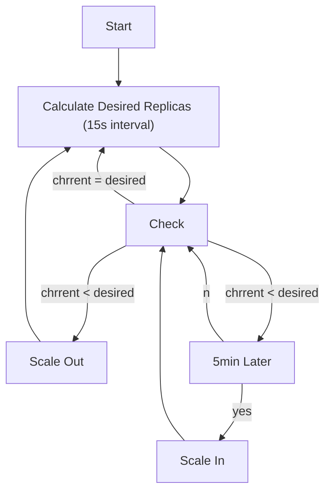

## README

HPA is standard API resource, so you don't need install it. However HPA requires Metrics Server.

* [simple/README.md](simple/README.md)
* [behavior/README.md](behavior/README.md)

## Reference

* [k8sのオートスケール(HPA)を抑えよう！/ HPA Deep Dive](https://speakerdeck.com/oracle4engineer/hpa-deep-dive)
* [Metrics Server](https://speakerdeck.com/bells17/metrics-server)
* [結局requestsとlimitsはどう設定すればいいのか](https://speakerdeck.com/nao_saino/jie-ju-requeststolimitshadoushe-ding-surebaiifalseka)

## HPA Behavior

Default HPA flowchart is follows. You can customize this flow with `spec.behavior`



## Getting Started HPA

HPA requires `Metrics Server`. Please follow instruction to install Metrics Server with helm.

### Docker Desktop

 **helm chart**

 ```sh
 helm repo add metrics-server https://kubernetes-sigs.github.io/metrics-server/
 helm upgrade --install metrics-server metrics-server/metrics-server --version 3.10.0 -f ./hpa/values-metrics-server-dockerdesktop.yaml -n kube-system --wait
 kubectl get deployment metrics-server -n kube-system
 ```

### EKS

> see: https://docs.aws.amazon.com/ja_jp/eks/latest/userguide/metrics-server.html

 **helm chart**

 ```sh
 helm repo add metrics-server https://kubernetes-sigs.github.io/metrics-server/
 helm upgrade --install metrics-server metrics-server/metrics-server --version 3.10.0 -f ./hpa/values-metrics-server-eks.yaml -n kube-system --wait
 kubectl get deployment metrics-server -n kube-system
 ```

 **Manifest**

 ```sh
 kubectl apply -f https://github.com/kubernetes-sigs/metrics-server/releases/latest/download/components.yaml
 kubectl get deployment metrics-server -n kube-system
 ```
