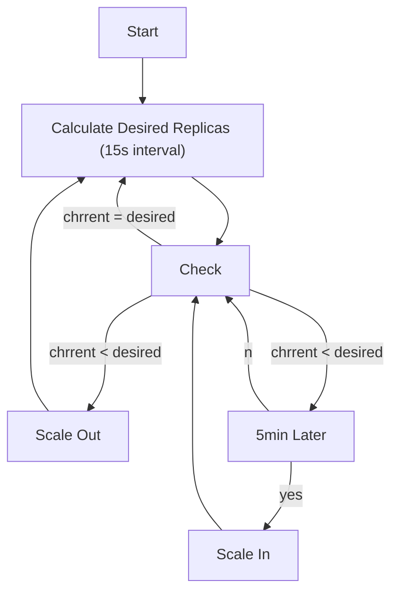

## README

HPA is standard API resource, so you don't need install it. However HPA requires Metrics Server.

* [simple/README.md](simple/README.md)
* [behavior/README.md](behavior/README.md)

## Reference

* [k8sのオートスケール(HPA)を抑えよう！/ HPA Deep Dive](https://speakerdeck.com/oracle4engineer/hpa-deep-dive)
* [Metrics Server](https://speakerdeck.com/bells17/metrics-server)
* [結局requestsとlimitsはどう設定すればいいのか](https://speakerdeck.com/nao_saino/jie-ju-requeststolimitshadoushe-ding-surebaiifalseka)

## Recomendation

the HorizontalPodAutoscaler controller operates on the ratio between desired metric value and current metric value.

> see: https://kubernetes.io/docs/tasks/run-application/horizontal-pod-autoscale/#algorithm-details

```math
desiredReplicas = ceil[currentReplicas * ( currentMetricValue / desiredMetricValue )]
```

This value is used to determine how many replicas shoule be.

## HPA Behavior

Default HPA flowchart is follows. You can customize this flow with `spec.behavior`



Default Behavior is as follows.

```yaml
behavior:
  scaleDown:
    stabilizationWindowSeconds: 300
    policies:
    - type: Percent
      value: 100
      periodSeconds: 15
  scaleUp:
    stabilizationWindowSeconds: 0
    policies:
    - type: Percent
      value: 100
      periodSeconds: 15
    - type: Pods
      value: 4
      periodSeconds: 15
    selectPolicy: Max
```

**stabilizationWindowSeconds**

The stabilization window is used to restrict the flapping of replica count when the metrics used for scaling keep fluctuating. The autoscaling algorithm uses this window to infer a previous desired state and avoid unwanted changes to workload scale.

For example, in the above example snippet, a stabilization window is specified for scaleDown `300sec`. When the metrics indicate that the target should be scaled down the algorithm looks into previously computed desired states, and uses the highest value from the specified interval. In the above example, all desired states from the past 5 minutes will be considered. This approximates a rolling maximum, and avoids having the scaling algorithm frequently remove Pods only to trigger recreating an equivalent Pod just moments later.

## Getting Started HPA

HPA requires `Metrics Server`. Please follow instruction to install Metrics Server with helm.

### Docker Desktop

 **helm chart**

 ```sh
 helm repo add metrics-server https://kubernetes-sigs.github.io/metrics-server/
 helm upgrade --install metrics-server metrics-server/metrics-server --version 3.10.0 -f ./hpa/values-metrics-server-dockerdesktop.yaml -n kube-system --wait
 kubectl get deployment metrics-server -n kube-system
 ```

### EKS

> see: https://docs.aws.amazon.com/ja_jp/eks/latest/userguide/metrics-server.html

 **helm chart**

 ```sh
 helm repo add metrics-server https://kubernetes-sigs.github.io/metrics-server/
 helm upgrade --install metrics-server metrics-server/metrics-server --version 3.10.0 -f ./hpa/values-metrics-server-eks.yaml -n kube-system --wait
 kubectl get deployment metrics-server -n kube-system
 ```

 **Manifest**

 ```sh
 kubectl apply -f https://github.com/kubernetes-sigs/metrics-server/releases/latest/download/components.yaml
 kubectl get deployment metrics-server -n kube-system
 ```
