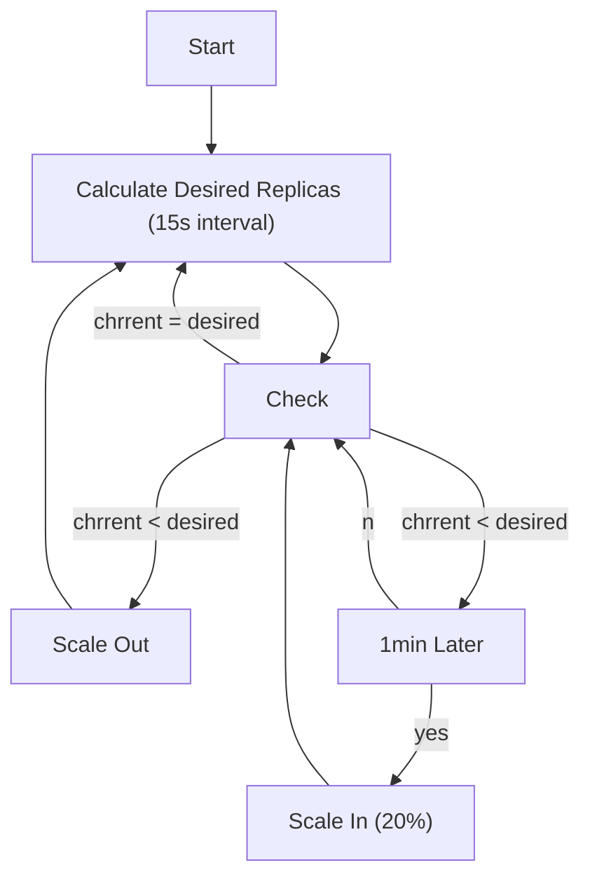

## README

Before runnning this sample, install Metrics-Server. see [hpa/README.md](../README.md).

Customized HPA behavior based on CPU.



## Deploy HPA

Run Server with cli or yaml manifest.

yaml manifest.

```sh
kubens default
kubectl apply -f hpa/behavior/httpbin.yaml
kubectl apply -f hpa/behavior/httpbin-hpa.yaml
kubectl get hpa
```

## Try HPA with LoadTesting

Before start loadtesting, open a new shell and watch Server status.

```sh
kubectl get po -w
```

Open a new shell and watch HPA status.

```sh
kubectl get hpa -w
```

Open new shell and run LoadTest. This makes scale out httpbin pod.

```sh
$ kubectl run -i --tty load-generator --rm --image=alpine/bombardier:v1.2.5 --restart=Never -- -c 5 -d 210s http://envoy

If you don't see a command prompt, try pressing enter.

[====================================================================================================================================================================================] 3m30sDone!
Statistics        Avg      Stdev        Max
  Reqs/sec      1019.59     796.86    3754.22
  Latency        4.90ms     9.60ms    79.08ms
  HTTP codes:
    1xx - 0, 2xx - 214198, 3xx - 0, 4xx - 0, 5xx - 0
    others - 0
  Throughput:     9.62MB/s
pod "load-generator" deleted
```

## HPA Result

httpbin requests.cpu is `200m` and HPA is set with CPU percent `60%`, therefore hpa will scale pod when cpu utilization reached 120m.

```sh
$ k get hpa -w
NAME      REFERENCE            TARGETS   MINPODS   MAXPODS   REPLICAS   AGE
httpbin   Deployment/httpbin   0%/60%    1         12        1          55m
httpbin   Deployment/httpbin   455%/60%   1         12        1          56m
httpbin   Deployment/httpbin   119%/60%   1         12        5          57m
httpbin   Deployment/httpbin   64%/60%    1         12        10         58m
httpbin   Deployment/httpbin   25%/60%    1         12        10         59m
httpbin   Deployment/httpbin   0%/60%     1         12        8          60m
httpbin   Deployment/httpbin   0%/60%     1         12        6          61m
httpbin   Deployment/httpbin   0%/60%     1         12        4          62m
httpbin   Deployment/httpbin   0%/60%     1         12        3          63m
httpbin   Deployment/httpbin   0%/60%     1         12        2          64m
httpbin   Deployment/httpbin   0%/60%     1         12        1          65m
```

```sh
$ kubectl resource-capacity --util --pods -n default
NODE             POD                       CPU REQUESTS   CPU LIMITS   CPU UTIL      MEMORY REQUESTS   MEMORY LIMITS   MEMORY UTIL
docker-desktop   *                         500m (6%)      300m (3%)    1360m (17%)   384Mi (4%)        384Mi (4%)      64Mi (0%)
docker-desktop   envoy-7d4864df89-ksdsc    300m (3%)      300m (3%)    301m (3%)     256Mi (3%)        256Mi (3%)      23Mi (0%)
docker-desktop   httpbin-54f89b4b6-rrmdf   200m (2%)      0m (0%)      910m (11%)    128Mi (1%)        128Mi (1%)      38Mi (0%)
docker-desktop   load-generator            0m (0%)        0m (0%)      150m (1%)     0Mi (0%)          0Mi (0%)        4Mi (0%)

$ kubectl resource-capacity --util --pods -n default
NODE             POD                       CPU REQUESTS   CPU LIMITS   CPU UTIL      MEMORY REQUESTS   MEMORY LIMITS   MEMORY UTIL
docker-desktop   *                         1300m (16%)    300m (3%)    1360m (17%)   896Mi (11%)       896Mi (11%)     64Mi (0%)
docker-desktop   envoy-7d4864df89-ksdsc    300m (3%)      300m (3%)    301m (3%)     256Mi (3%)        256Mi (3%)      23Mi (0%)
docker-desktop   httpbin-54f89b4b6-9np69   200m (2%)      0m (0%)      0m (0%)       128Mi (1%)        128Mi (1%)      0Mi (0%)
docker-desktop   httpbin-54f89b4b6-9pdmq   200m (2%)      0m (0%)      0m (0%)       128Mi (1%)        128Mi (1%)      0Mi (0%)
docker-desktop   httpbin-54f89b4b6-rrmdf   200m (2%)      0m (0%)      910m (11%)    128Mi (1%)        128Mi (1%)      38Mi (0%)
docker-desktop   httpbin-54f89b4b6-s7nmw   200m (2%)      0m (0%)      0m (0%)       128Mi (1%)        128Mi (1%)      0Mi (0%)
docker-desktop   httpbin-54f89b4b6-wh2n5   200m (2%)      0m (0%)      0m (0%)       128Mi (1%)        128Mi (1%)      0Mi (0%)
docker-desktop   load-generator            0m (0%)        0m (0%)      150m (1%)     0Mi (0%)          0Mi (0%)        4Mi (0%)

$ kubectl resource-capacity --util --pods -n default
NODE             POD                       CPU REQUESTS   CPU LIMITS   CPU UTIL      MEMORY REQUESTS   MEMORY LIMITS   MEMORY UTIL
docker-desktop   *                         1300m (16%)    300m (3%)    1630m (20%)   896Mi (11%)       896Mi (11%)     215Mi (2%)
docker-desktop   envoy-7d4864df89-ksdsc    300m (3%)      300m (3%)    301m (3%)     256Mi (3%)        256Mi (3%)      24Mi (0%)
docker-desktop   httpbin-54f89b4b6-9np69   200m (2%)      0m (0%)      239m (2%)     128Mi (1%)        128Mi (1%)      38Mi (0%)
docker-desktop   httpbin-54f89b4b6-9pdmq   200m (2%)      0m (0%)      243m (3%)     128Mi (1%)        128Mi (1%)      38Mi (0%)
docker-desktop   httpbin-54f89b4b6-rrmdf   200m (2%)      0m (0%)      240m (3%)     128Mi (1%)        128Mi (1%)      38Mi (0%)
docker-desktop   httpbin-54f89b4b6-s7nmw   200m (2%)      0m (0%)      238m (2%)     128Mi (1%)        128Mi (1%)      38Mi (0%)
docker-desktop   httpbin-54f89b4b6-wh2n5   200m (2%)      0m (0%)      238m (2%)     128Mi (1%)        128Mi (1%)      38Mi (0%)
docker-desktop   load-generator            0m (0%)        0m (0%)      134m (1%)     0Mi (0%)          0Mi (0%)        5Mi (0%)

$ kubectl resource-capacity --util --pods -n default
NODE             POD                       CPU REQUESTS   CPU LIMITS   CPU UTIL      MEMORY REQUESTS   MEMORY LIMITS   MEMORY UTIL
docker-desktop   *                         2300m (28%)    300m (3%)    1630m (20%)   1536Mi (19%)      1536Mi (19%)    215Mi (2%)
docker-desktop   envoy-7d4864df89-ksdsc    300m (3%)      300m (3%)    301m (3%)     256Mi (3%)        256Mi (3%)      24Mi (0%)
docker-desktop   httpbin-54f89b4b6-4j7sq   200m (2%)      0m (0%)      0m (0%)       128Mi (1%)        128Mi (1%)      0Mi (0%)
docker-desktop   httpbin-54f89b4b6-62ddg   200m (2%)      0m (0%)      0m (0%)       128Mi (1%)        128Mi (1%)      0Mi (0%)
docker-desktop   httpbin-54f89b4b6-7sv98   200m (2%)      0m (0%)      0m (0%)       128Mi (1%)        128Mi (1%)      0Mi (0%)
docker-desktop   httpbin-54f89b4b6-9np69   200m (2%)      0m (0%)      239m (2%)     128Mi (1%)        128Mi (1%)      38Mi (0%)
docker-desktop   httpbin-54f89b4b6-9pdmq   200m (2%)      0m (0%)      243m (3%)     128Mi (1%)        128Mi (1%)      38Mi (0%)
docker-desktop   httpbin-54f89b4b6-jm662   200m (2%)      0m (0%)      0m (0%)       128Mi (1%)        128Mi (1%)      0Mi (0%)
docker-desktop   httpbin-54f89b4b6-k72d9   200m (2%)      0m (0%)      0m (0%)       128Mi (1%)        128Mi (1%)      0Mi (0%)
docker-desktop   httpbin-54f89b4b6-rrmdf   200m (2%)      0m (0%)      240m (3%)     128Mi (1%)        128Mi (1%)      38Mi (0%)
docker-desktop   httpbin-54f89b4b6-s7nmw   200m (2%)      0m (0%)      238m (2%)     128Mi (1%)        128Mi (1%)      38Mi (0%)
docker-desktop   httpbin-54f89b4b6-wh2n5   200m (2%)      0m (0%)      238m (2%)     128Mi (1%)        128Mi (1%)      38Mi (0%)
docker-desktop   load-generator            0m (0%)        0m (0%)      134m (1%)     0Mi (0%)          0Mi (0%)        5Mi (0%)

$ kubectl resource-capacity --util --pods -n default
NODE             POD                       CPU REQUESTS   CPU LIMITS   CPU UTIL      MEMORY REQUESTS   MEMORY LIMITS   MEMORY UTIL
docker-desktop   *                         2300m (28%)    300m (3%)    1716m (21%)   1536Mi (19%)      1536Mi (19%)    402Mi (5%)
docker-desktop   envoy-7d4864df89-ksdsc    300m (3%)      300m (3%)    300m (3%)     256Mi (3%)        256Mi (3%)      25Mi (0%)
docker-desktop   httpbin-54f89b4b6-4j7sq   200m (2%)      0m (0%)      129m (1%)     128Mi (1%)        128Mi (1%)      38Mi (0%)
docker-desktop   httpbin-54f89b4b6-62ddg   200m (2%)      0m (0%)      130m (1%)     128Mi (1%)        128Mi (1%)      38Mi (0%)
docker-desktop   httpbin-54f89b4b6-7sv98   200m (2%)      0m (0%)      129m (1%)     128Mi (1%)        128Mi (1%)      38Mi (0%)
docker-desktop   httpbin-54f89b4b6-9np69   200m (2%)      0m (0%)      129m (1%)     128Mi (1%)        128Mi (1%)      38Mi (0%)
docker-desktop   httpbin-54f89b4b6-9pdmq   200m (2%)      0m (0%)      131m (1%)     128Mi (1%)        128Mi (1%)      38Mi (0%)
docker-desktop   httpbin-54f89b4b6-jm662   200m (2%)      0m (0%)      129m (1%)     128Mi (1%)        128Mi (1%)      38Mi (0%)
docker-desktop   httpbin-54f89b4b6-k72d9   200m (2%)      0m (0%)      129m (1%)     128Mi (1%)        128Mi (1%)      38Mi (0%)
docker-desktop   httpbin-54f89b4b6-rrmdf   200m (2%)      0m (0%)      129m (1%)     128Mi (1%)        128Mi (1%)      38Mi (0%)
docker-desktop   httpbin-54f89b4b6-s7nmw   200m (2%)      0m (0%)      128m (1%)     128Mi (1%)        128Mi (1%)      38Mi (0%)
docker-desktop   httpbin-54f89b4b6-wh2n5   200m (2%)      0m (0%)      129m (1%)     128Mi (1%)        128Mi (1%)      38Mi (0%)
docker-desktop   load-generator            0m (0%)        0m (0%)      130m (1%)     0Mi (0%)          0Mi (0%)        5Mi (0%)
```

## Clean up

Clean up resources.

```sh
kubectl delete -f hpa/behavior/httpbin-hpa.yaml
kubectl delete -f hpa/behavior/httpbin.yaml
```
